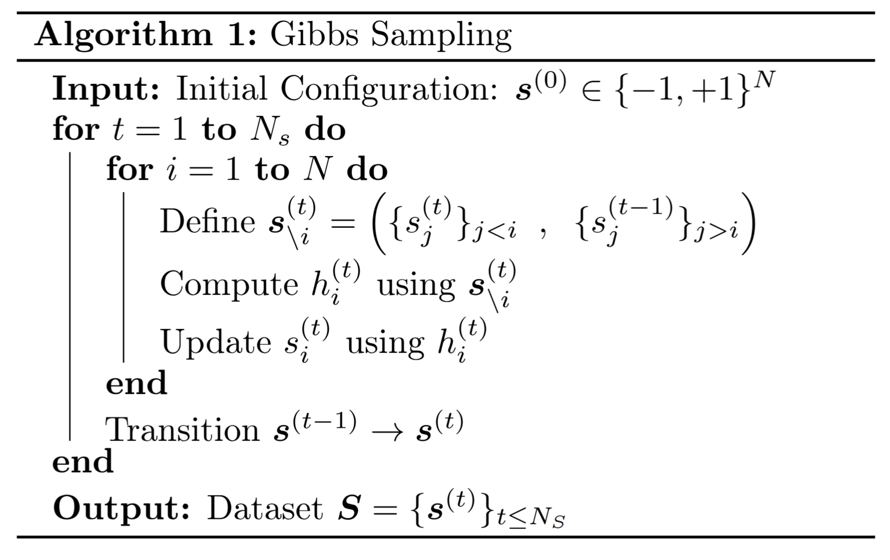
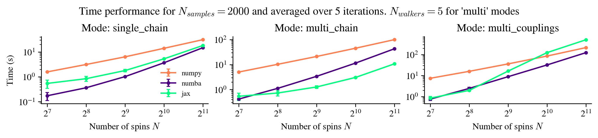

Name: Cristopher Ricardo Erazo Vallejos  
Email: cerazova@sissa.it  
Course: TSDS PhD.  

# Spin Sampler Library

The **Spin Sampler** library is a Python package designed to sample configurations from the Boltzmann distribution of a spin system with pairwise interactions using Gibbs Sampling. This library is particularly useful for spin glasses, where the lack of structure in the interactions makes Gibbs sampling the only viable option for simulation.  

For more details, check the [documentation](https://cristophererazo.github.io/devtools_scicomp_project_2025/).


---

## Objectives

- Implement a flexible and efficient Gibbs sampling framework for spin glasses.  
- Compare the performance of different backends for the computations.  

---

## Problem

The goal is to sample configurations $\mathbf{s} \in \lbrace -1,+1\rbrace^N$ from the Boltzmann distribution of a system of $N$ spins in thermal equilibrium at temperature $T = 1/\beta$:

$$
\mu(\mathbf{s}) = \frac{e^{-\beta H(\mathbf{s})}}{Z_\beta}
$$

The system is governed by a Hamiltonian with pairwise interactions:

$$
H(\mathbf{s}) = -\frac{1}{2} \sum_{i=1}^N s_i J_{ij} s_j
$$

Here, the coupling matrix $\mathbf{J} = (J_{ij})$ fully characterizes the system. In spin glass models, $\mathbf{J}$ is usually a random variable.  

The sampler provides three modes for different use cases:

- `single_chain`: Runs one Markov chain for Gibbs sampling. This is the default and works well for most applications.  
- `multi_chains`: Runs multiple chains in parallel with the same coupling matrix. Useful for exploring the state space from different initial conditions or obtaining statistically independent samples.  
- `multi_couplings`: Runs multiple chains in parallel, each with a different coupling matrix. Useful for studying ensembles of systems where $\mathbf{J}$ is drawn from a distribution $\mathbb{P}(\mathbf{J})$.  

---

## Algorithm


To sample from the distribution $\mu(\mathbf{s})$, we use the Gibbs sampling algorithm, which updates spins sequentially according to the conditional probability that can be computed analitically.

$$
P(s_i = +1 \mid \mathbf{s}_{\backslash i}) = \frac{1}{1 + \exp(-2\beta h_i)}
$$

where $\mathbf{s}_{\backslash i} = \lbrace s_j : j  ≠  i\rbrace$ and the local field is:

$$
h_i = \sum_{j \neq i} J_{ij} s_j
$$

To obtain a dataset $\mathbf{S}$ of $N_s$ samples, we start with an initial configuration $\mathbf{s}^{(0)}$ and run the Gibbs Sampling procedure.  

<div style="text-align: center;">
    
</div>


The inner loop over the $N$ spins is referred to as a `gibbs_step`, and it is the main bottleneck of the algorithm. Because the updates must be done sequentially, parallelization is not possible, limiting performance.  

---

## Installation

To install the Spin Sampler library :

1. Clone the repository:
    ```bash
    git clone https://github.com/CristopherErazo/devtools_scicomp_project_2025.git <folder_name>

    ```

2. Navigate to the folder directory, create and activate a virtual environment (with `python 3.9` preferably) and install the required dependencies:
    ```bash
    pip install -r requirements.txt
    ```
3. Precompile the `numba` module. This creates a `.so` file that containes the precompiled version of the `numba` functions and can be called as a module:

    ```bash
    python src/spin_sampler/compile_gibbs.py
    ```

4. Install the package:
    ```bash
    pip install .
    ```

More details are available in the [installation guide](https://cristophererazo.github.io/devtools_scicomp_project_2025/installation.html).  

---

## Usage

The simplest usage of the package is to extract samples from the Boltzmann distribution:

```python
from spin_sampler import Sampler , define_SK_model , initialize_spins
import numpy as np

# Define parameters of the system
N = 100     # Number of spins
T = 1.0     # Temperature

# Define the couplings and initialize spins
J = define_SK_model(N)
initial_state = initialize_spins(N)

# Create a sampler instance
sampler = Sampler(J, T)
# Perform sampling
final_state = sampler.run_gibbs(initial_state,N_samples=10,dt_samples=1,store=True)
# Get the samples
chain = sampler.get_chain()
# Clean up the sampler
sampler.reset_chain()
# chain.shape = (10,100) = (N_samples,N)
```

The `run_gibbs` method returns the last spin configuration. If `store=True`, the full chain of samples is saved in `sampler.chain` and can be accessed with `get_chain()`.

The parameter `dt_samples` controls how many Gibbs steps are performed between consecutive stored samples, reducing time correlations when needed.

More examples are available in the [usage guide](https://cristophererazo.github.io/devtools_scicomp_project_2025/usage.html).

---

## Profiling and Optimization

Profiling with `line_profiler` shows that the bottleneck is the sequential Gibbs step updates, which cannot be parallelized. Below is an extract from the profiling logs that can be found in the `logs` folder:

```
Line #      Hits         Time  Per Hit   % Time  Line Contents
--------------------------------------------------------------
   178                                                   # Main sampling loop
   179      1503       1042.9      0.7      0.0          for step in range(N_samples*dt_samples):
   180      1500   18322600.0  12215.1     97.2              S , key = self.step(S,rnd_ord=rnd_ord,key=key)  
```

The same set of profiling experiments can be performed locally running:

```bash
./shell/submit_profile.sh
```

This script creates 3 configurations in the `experiments` folder and runs profiling via `kernprof -l -v scripts/run_profile.py `. Results are stored in the `logs` folder and the experiment takes a couple of minutes to run. 


To improve performance, the `Sampler` class supports multiple backends for Gibbs updates:

- `numpy` (default)  
- `numba` (precompiled numpy, faster)  
- `jax` (with `@jit` compilation and `jax.lax.fori_loop`)  

See the  [API](https://cristophererazo.github.io/devtools_scicomp_project_2025/api.html#gibbs-steps) for more details.

---

## Performance Results

Timing results for different modes and backends as system size increases:




**Observations:**
- `single_chain`: `numba` is generally fastest; `jax` catches up for large systems.  
- `multi_chains`: `jax` significantly outperforms others.  
- `multi_couplings`: `jax` performs poorly at scale; `numba` is better.  
- `numpy` is consistently the slowest with exceptions in the last case.  

The timing experiment can be reproduced running:

```bash
python scripts/run_timing.py -c experiments/config_timing
```

this will create a new data file in the `logs` directory and then 

```bash
python scripts/plot_timing.py
```

will create a plot of the results, saving the image in the same directory.

⚠️ **Note**: Experiments may take more than 1 hour due to scaling with $N$. To speed up, reduce parameters in `experiments/config_timing.yaml`. You can play with `Ns`, `N_samples` or `N_iterations`. 


---

## Future Improvements

To keep comparisons fair, the `gibbs_step` logic was kept similar across `numpy` and `jax` implementations. However, since each library offers unique optimizations, customizing the implementation for each backend could lead to better performance.

Bellow we see a summary of the profiling  results within the `gibbs_step` function for the `numpy` case in the 3 sampling modes.


```
mode = 'single_chain'
backend = 'numpy'

Line #      Hits         Time  Per Hit   % Time  Line Contents
--------------------------------------------------------------
    40                                               # Update sequentially the spins
    41   1000500     454238.1      0.5      3.3      for i in idx:
    42   1000000    5197721.8      5.2     38.1          h_i = S @ J[i]
    43   1000000    5610470.3      5.6     41.1          p_plus = prob_plus(beta * h_i)
    44   1000000    1475456.7      1.5     10.8          rand_vals = np.random.rand()
    45   1000000     882210.3      0.9      6.5          S[i] = 1 if rand_vals < p_plus else -1
    46       500        304.3      0.6      0.0      return S , key
```

```
mode = 'multi_chain'
backend = 'numpy'

Line #      Hits         Time  Per Hit   % Time  Line Contents
--------------------------------------------------------------
    72                                               # Update sequentially the spins
    73   1000500     499579.8      0.5      1.8      for i in idx:
    74   1000000    6579821.6      6.6     23.4          h_i = S @ J[i]
    75   1000000   11818354.3     11.8     42.1          p_plus = prob_plus(beta * h_i)
    76   1000000    2887706.0      2.9     10.3          rand_vals = np.random.rand(N_walkers)
    77   1000000    6266237.2      6.3     22.3          S[:, i] = np.where(rand_vals < p_plus, 1, -1)
    78       500        186.5      0.4      0.0      return S , key
```

```
mode = 'multi_couplings'
backend = 'numpy'

Line #      Hits         Time  Per Hit   % Time  Line Contents
--------------------------------------------------------------
   104                                               # Update sequentially the spins
   105   1000500     597413.8      0.6      1.1      for i in idx:
   106   1000000   29665515.6     29.7     54.6          h_i = np.sum(J[:, i] * S, axis=1)
   107   1000000   13684538.6     13.7     25.2          p_plus = prob_plus(beta * h_i)
   108   1000000    3392265.7      3.4      6.2          rand_vals = np.random.rand(N_walkers)
   109   1000000    6944719.2      6.9     12.8          S[:, i] = np.where(rand_vals < p_plus, 1, -1)
   110       500        189.9      0.4      0.0      return S  , key
```

Profiling shows that the most expensive operations are computing local fields $h_i$ and probabilities $P(s_i = +1 \mid \mathbf{s}_{\setminus i})$ but the load is different for different modes. Implementing other optimization techniques, such as vectorization across chains when possible, may yield significant speedups.


---


## Conclusion

The **Spin Sampler** library is a powerful tool for studying spin systems combining flexibility, performance, and ease of use. Profiling the code helped identify bottlenecks in the algorithm and using backends such as `numba` and `jax` showed performance improvements over plain `numpy` implementation.

Scalability experiments show non-trivial behavior depending on `mode` and `backend`, giving users a guidance for which configuration to choose when performing an experiment.

Further improvements can be achieved by tailoring the code to each backend and exploiting vectorization techniques whenever possible.


---

## Documentation

- [Introduction](https://cristophererazo.github.io/devtools_scicomp_project_2025/introduction.html)  
- [Installation](https://cristophererazo.github.io/devtools_scicomp_project_2025/installation.html)  
- [Usage](https://cristophererazo.github.io/devtools_scicomp_project_2025/usage.html)  
- [API](https://cristophererazo.github.io/devtools_scicomp_project_2025/api.html)  
